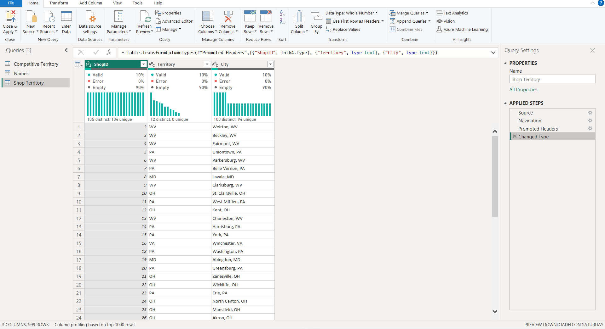
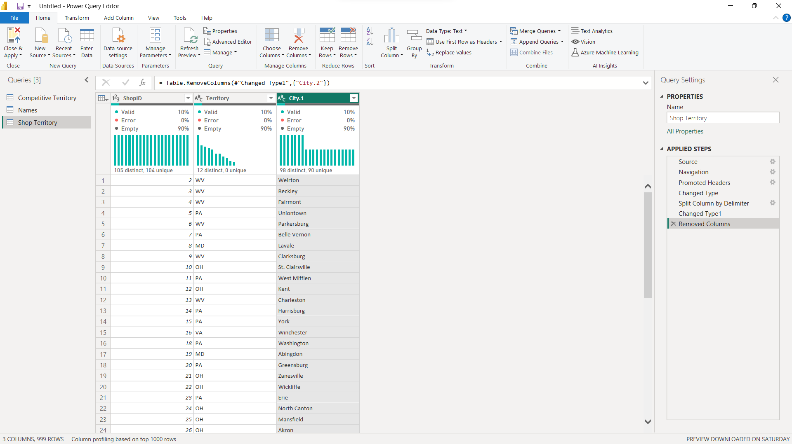
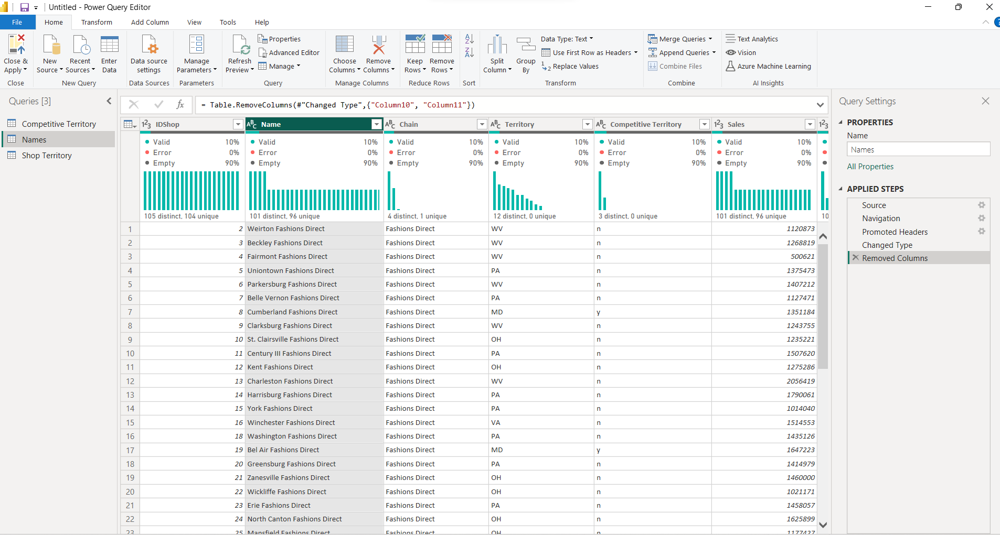
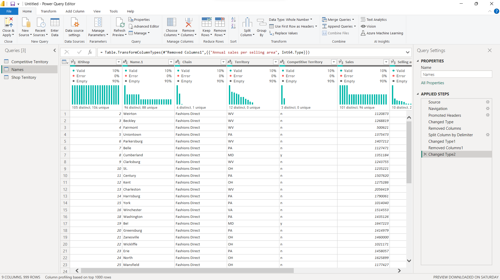
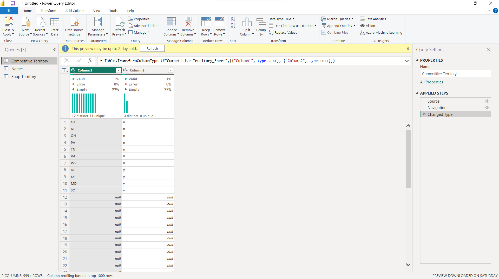
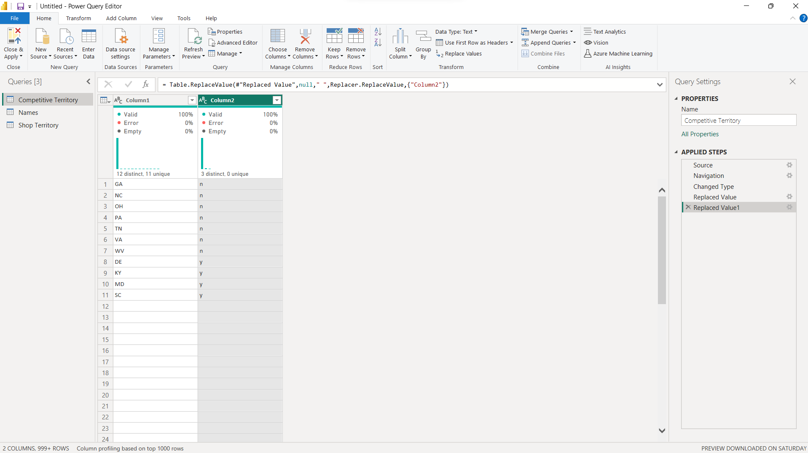
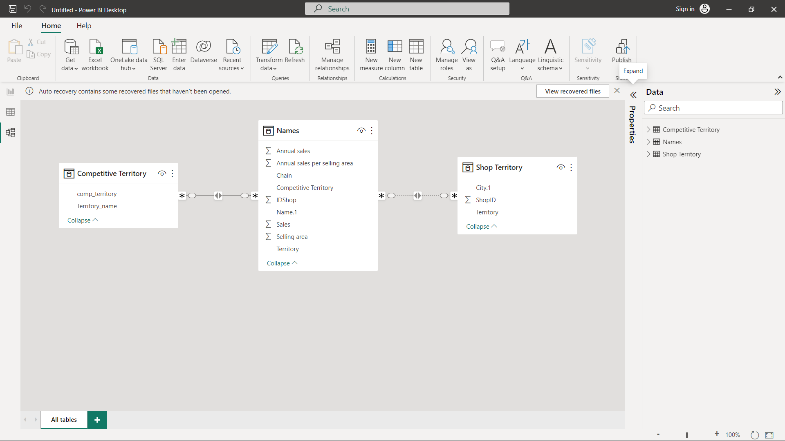
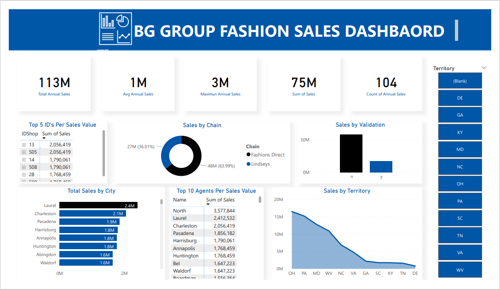

# DG_Fashion_stores

## Introduction
My current training at Utiva included a Capstone Project focused on the BG Group premium fashion lines. This project allowed me to practice my data cleaning, analysis, and visualization skills using power bi. Additionally, I created a reporting dashboard to showcase my findings from the dataset. Overall, the project was an excellent opportunity to apply what I learned in the training and gain hands-on experience with real-world data.

## Problem statement 
-	What are the top sales by City?
- What are the top 10 agents per sales value?
- Sales territory?
- Sales by validation?
- Sales chain category?
- Top 5 IDs per sale value?

 Create a dashboard with the report and sliceable by:
- 	Territory
   
## Skills/Concepts Demonstrated
Power Query
Dashboard 
Data Modelling

## Data Preparation / Cleaning:
The dataset was shared with students of Utiva., showing sales of BG Group premium fashion lines.
It has 3 tables;
Names (9 columns   105 rows)
Shop Territory (3 columns 105 rows)
Competitive Territory (2 columns and 11 rows)

## Data cleaning and transformation
 For the shop territory,  I had to split the city column

Name table I had to split the names column, set the change the data type for sales, annual, sales, and Annual sales per selling area to whole number data type

The Competitive territory
I replaced the null with empty space for the two columns

## Data Modelling
I had to create relationships between the three tables 
- For the Names table
 columns IDshop one to many relationships with Shop Territory shopID
- Competitive territory table
Comp_territory one many relationships with the Names table competitive territory

## My Dashboard

To interact with the dashboard: https://app.powerbi.com/groups/me/reports/ce44ad51-255e-4abd-ba24-52229d7814c7/ReportSection?experience=power-bi

